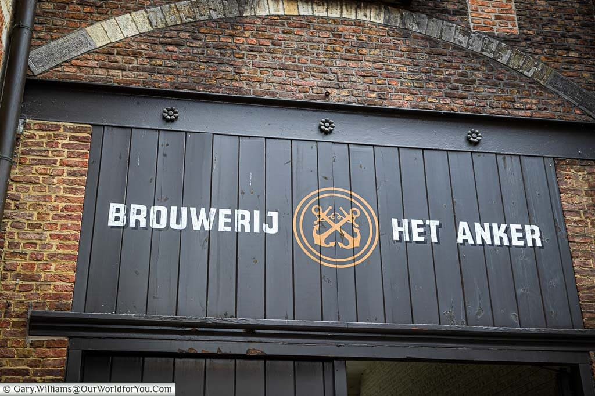

<!DOCTYPE html>
<html lang="en">
<head>
    <meta charset="UTF-8">
    <meta name="viewport" content="width=device-width, initial-scale=1.0">
    <title>Het Anker Homepage</title>
    
</head>

# Welcome to the Het Anker Homepage

The [Het Anker homepage](https://www.hetanker.be/nl) is a delightful place to explore a world of fine Belgian beer and historical charm. Located in Mechelen, Belgium, Het Anker is a renowned brewery with a rich history dating back to the 14th century.

On their website, you can discover a wide range of high-quality beers, including their famous Gouden Carolus brand. Whether you're a beer enthusiast or just curious about Belgian brewing traditions, the Het Anker homepage offers a fascinating journey through the world of beer.

Explore their selection of brews, learn about their brewing process, and immerse yourself in the culture of this iconic Belgian brewery. You can also find information about their brewery tours and events, making it a perfect destination for beer lovers from around the world.

Plan your visit to Het Anker and experience the passion and craftsmanship that goes into each bottle of their beer. Cheers to a world of flavors, history, and Belgian beer culture!

Visit the official [Het Anker website](https://www.hetanker.be/nl) to start your journey.
